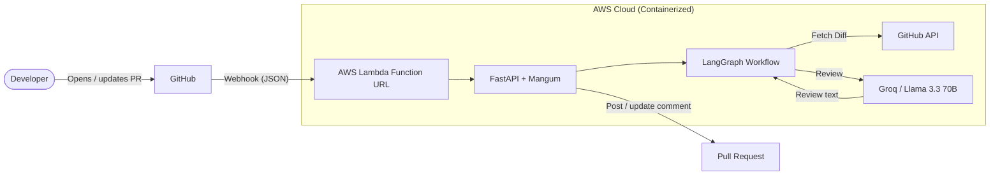

# 🛡️ CodeGuardian: Autonomous AI Pull Request Reviewer

CodeGuardian is an event-driven, serverless AI agent that acts as a first-pass code reviewer. It hooks into GitHub, reads the diff of a Pull Request (PR), asks an LLM to look for bugs, security issues and style problems, and posts the feedback as a PR comment.

## 🏗️ Architecture

Serverless, event-driven: a GitHub webhook triggers an AWS Lambda function running a FastAPI app, which runs a LangGraph workflow. The function only runs (and only costs money) when a PR is opened or updated.



See [architecture.md](architecture.md) for a component-by-component description and known limitations.

## 🚀 Key Features

* **Event-driven triggers:** GitHub webhooks (`pull_request` opened / synchronize) sent to an AWS Lambda Function URL.
* **LLM review:** Llama 3.3 70B (via Groq) reviews the diff for bugs, security issues and style.
* **Stateful orchestration:** a two-node LangGraph workflow (fetch diff -> analyze).
* **Secure endpoint:** HMAC SHA-256 signature verification rejects unauthorised payloads.
* **No duplicate comments:** CodeGuardian updates its earlier comment on a PR instead of adding a new one on every push.
* **Containerized:** packaged with Docker for AWS Lambda.

## 🛠️ Tech Stack

* **Core logic:** Python 3.10, LangChain, LangGraph
* **API framework:** FastAPI, Mangum (AWS Lambda adapter)
* **Infrastructure:** AWS Lambda, AWS ECR
* **LLM provider:** Groq (`llama-3.3-70b-versatile`)
* **GitHub access:** PyGithub
* **DevOps:** Docker (GitHub Actions planned)

## 🔌 Endpoints

| Method | Path | Purpose |
|---|---|---|
| `POST` | `/webhook` | Receives GitHub webhooks. Requires a valid `X-Hub-Signature-256` header (`403` otherwise). Runs a review on `pull_request` events with action `opened` or `synchronize`; ignores everything else. Returns `502` if the review or the GitHub comment fails. |
| `GET` | `/` | Health check. |

## 🔧 Setup & Installation

### Prerequisites
* Python 3.10+
* Docker Desktop
* AWS CLI (configured)
* A GitHub account and a personal access token that can read and comment on pull requests
* A Groq API key

### 1. Local development

```bash
git clone https://github.com/iamgautamraj/CodeGuardian.git
cd CodeGuardian
pip install -r requirements.txt
```

Create a `.env` file (never commit it; it is listed in `.gitignore`):

```
GITHUB_TOKEN="your_personal_access_token"
GROQ_API_KEY="your_groq_api_key"
WEBHOOK_SECRET="your_random_secret_string"
# Optional: max diff characters sent to the LLM (default 24000)
# MAX_DIFF_CHARS=24000
```

Run the local server:

```bash
uvicorn main:app --reload
```

Expose port 8000 with ngrok or GitHub Codespaces and point a GitHub webhook (content type `application/json`, secret = `WEBHOOK_SECRET`, event: Pull requests) at `<public-url>/webhook`.

### 2. Deploy to AWS (serverless)

Build and push the Docker image. The image does **not** contain your secrets; they are set on the Lambda function in the next step.

```bash
# Login to AWS ECR
aws ecr get-login-password --region your-region | docker login --username AWS --password-stdin your-account-id.dkr.ecr.your-region.amazonaws.com

# Build & push
docker build -t code-guardian .
docker tag code-guardian:latest your-account-id.dkr.ecr.your-region.amazonaws.com/code-guardian:latest
docker push your-account-id.dkr.ecr.your-region.amazonaws.com/code-guardian:latest
```

### Lambda configuration
1. Create a Lambda function from the container image.
2. Set Timeout to 60s and Memory to 512MB.
3. Add `GITHUB_TOKEN`, `GROQ_API_KEY` and `WEBHOOK_SECRET` as environment variables.
4. Enable a Function URL (Auth type: NONE; requests are protected by the HMAC signature check) and use `<function-url>/webhook` as the GitHub webhook URL.

## ⚠️ Known Limitations

* The review runs inside the webhook request, and GitHub expects a response within about 10 seconds, so a slow review can show as a failed delivery. Moving to queue-based or asynchronous processing is on the roadmap.
* Feedback is a single general PR comment, not line-level comments.
* Diffs larger than `MAX_DIFF_CHARS` are truncated, so only part of a large PR is reviewed.
* The system prompt tells the model to ignore instructions inside the diff, which reduces but does not eliminate prompt-injection risk.

## 🔮 Roadmap

- [ ] Chunk / summarise large diffs per file instead of truncating
- [ ] Filter low-confidence or nitpicky comments before posting
- [ ] Line-specific comments via the GitHub Review API
- [ ] Asynchronous processing (SQS or async Lambda invocation)
- [ ] Custom style guides: read a `CONTRIBUTING.md` to enforce team rules
- [ ] Vector memory of earlier reviews
- [ ] Unit tests and a GitHub Actions CI pipeline

## 🤝 Contributing

Pull requests are welcome! For major changes, please open an issue first to discuss what you would like to change.

## 📄 License

MIT